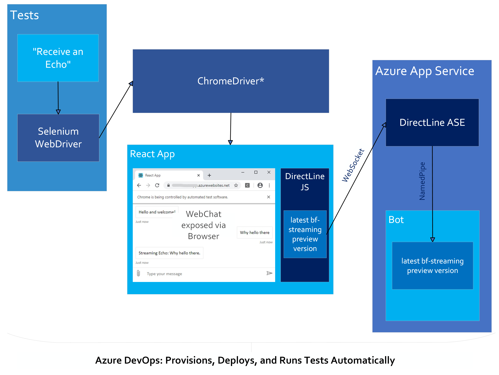
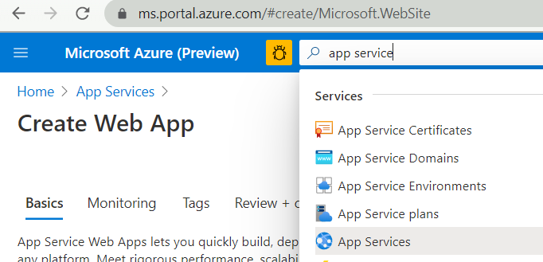
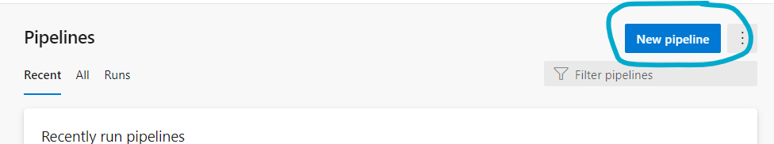
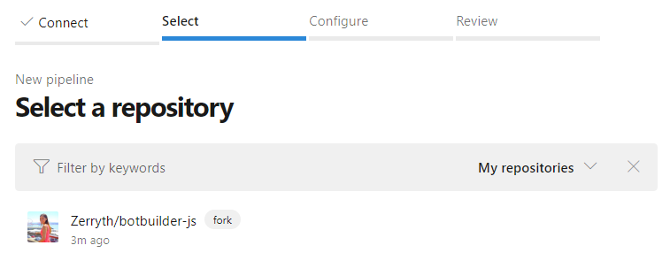
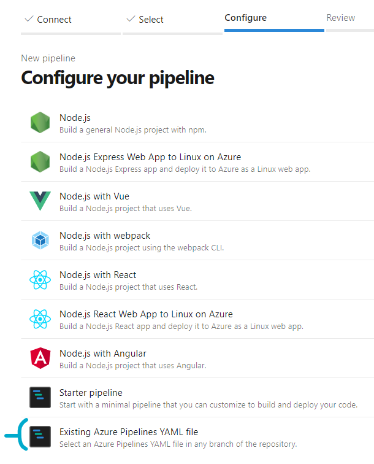

# End-to-End Streaming Tests Automation

## Description
The `streaming-e2e-tests` library automates the testing of `botframework-streaming`'s compatibility with different browsers.* These tests provision, deploy, and run all components involved in streaming through an Azure DevOps Pipeline.

*End-to-End Streaming Tests Architecture*

## Further Details on Test Setup
The project consists of two projects that get deployed (the [bot](#the-bot) and the [react app](#the-react-app)) and the [tests](#browser-tests-automation) themselves. To automate testing in the browser, the tests use [Selenium WebDriver](https://www.selenium.dev/documentation/en/webdriver/understanding_the_components/) to communicate to various browsers.

### The Bot
- The bot is built leveraging botframework-streaming. It is deployed to a DirectLine App Service Extension-enabled (DL ASE) App Service in Azure, as part of the DevOps Pipeline process.
- See documentation on [how to configure a bot to use DL ASE](https://docs.microsoft.com/en-us/azure/bot-service/bot-service-channel-directline-extension-node-bot?view=azure-bot-service-4.0).
- As part of the E2E testing pipeline, the suite ensures that the bot uses the latest botframework-streaming preview version before deploying the bot and running the tests.

### The React App
- To test the compatibility of using streaming in the browser with a [webpack](https://webpack.js.org/)ed project, the DevOps Pipeline provisions a brand new React app (`npx create-react-app).
- Subsequently the React App uses a customized DirectLineJS (DLJS)
    - To test streaming in browsers, we customize DLJS to use the latest botframework-streaming version
- To provide an interface that a user could go to test talking to a streaming bot manually, we use WebChat to as a channel in the React App

### Browser Tests Automation
- To automate testing in browsers, the E2E tests use Selenium WebDriver.
- The WebDriver communicates to browser-specific drivers (e.g. ChromeDriver for Chrome) to automate interactions in the browser, or "drive" the browser

# How to Run the Tests
These tests were built so that the SDK team can routinely run these E2E tests and ensure the compatibility of botframework-streaming and the browser. It does so by deploying the bot and React app to already-provisioned resources in the [Azure portal](https://ms.portal.azure.com/) that have been configured to enable DL ASE. If you wish to run these tests yourself, you must provision resources in your own Azure subscription first before you can run the automated pipeline built by the YAMLs included in the streaming-e2e-tests library.

1. You can provision the resources by simply deploying an [echo-bot sample](https://github.com/microsoft/BotBuilder-Samples/tree/master/samples/javascript_nodejs/02.echo-bot) via [zip-deployment](https://docs.microsoft.com/en-us/azure/bot-service/bot-builder-deploy-az-cli?view=azure-bot-service-4.0&tabs=javascript) manually in the Azure portal.
2. Additionally, you'll need an App Service for the React app.
    - .

## Azure DevOps Pipeline Configuration
The following steps guide you through the configuration of a build pipeline based on YAML file.

### Prerequisites
- Azure DevOps organization. You can find documentation [here](https://docs.microsoft.com/en-us/azure/devops/organizations/accounts/create-organization?view=azure-devops).
- Azure subscription. 

1. Create a pipeline in Azure DevOps.

2. Select GitHub YAML for code source.

3. Configure the repository and branch. Use `botbuilder-js/libaries/streaming-e2e-tests/streaming-e2e-tests-build.yml` as the root YAML of this pipeline.
    

        
Configuration Screen Shots

    
    - Select a GitHub repo that your Azure Pipeline will sync with. 
    
    
    - Select the option of "Existing Azure Pipelines YAML file" 
    
    - Select branch of the repo you want to sync with. For "Path" write the path to the [`streaming-e2e-tests-build.yml`](https://github.com/Zerryth/botbuilder-js/blob/Zerryth/streaming-e2e-tests/libraries/streaming-e2e-tests/build/streaming-e2e-tests-build.yml) file, which will be the "root"/"main" YAML to this testing pipeline. 
    

4. Add pipeline variables.
    - 

## Run the tests locally
While these tests do provision a new React app from scratch and configure it to use a customized DirectLineJS package that points to the latest botframework-streaming preview bits, they do not provision completely new resources in Azure. As such, if you wish to just test the current status of compatibility against the latest daily version of streaming, without any additional changes to the bot or React app, simply run the tests, and they will run against the bot and React app already deployed to Azure.

- Navigate to `streaming-e2e-tests/tests` folder
- `npm install`
- `npm test`

If however you would like to make changes to either the bot or React app, you would need to redeploy the changed project to persist the changes in Azure.

See [Azure DevOps Pipeline Configuration](#azure-devops-pipeline-configuration) to run through full test pipeline.

*Note: ChromeDriver is the Driver specific to Chrome. For automated tests in other browsers, you will need to pair it to the appropriate Driver specific to that browser. Most Drivers are created by the browser vendors themselves. See Selenium [Driver requirements](https://www.selenium.dev/documentation/en/webdriver/driver_requirements/) for more details. 